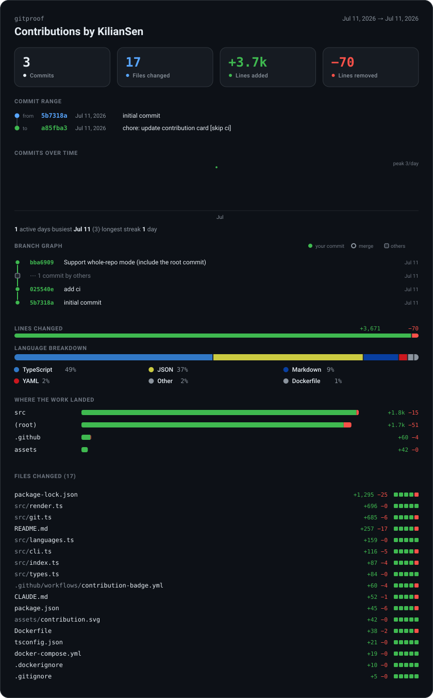

# gitproof

A tiny HTTP microservice that renders a single user's git contributions between
two commits as an **embeddable SVG** — built to make a thesis contribution to a
large open-source repo legible at a glance for a supervisor.

<!-- This card is gitproof rendering its own repo, refreshed on every push by
     .github/workflows/contribution-badge.yml — see "Generate a static SVG (CI)" below. -->


You point it at a repo, a `from` commit, a `to` commit, and a user, and it
returns a self-contained SVG card:

- **Headline totals** — commits, files changed, lines added, lines removed
- **Commit range** — the exact `from`/`to` bounds (short SHA · date · subject)
- **Commits over time** — a filled area chart (daily buckets for short ranges,
  weekly for long) with active-days / busiest-day / longest-streak facts
- **Branch graph** — your commits plus the merge commits that integrated them,
  in lanes. Runs of other contributors' commits are **squashed** into a single
  "⋯ N commits by others" node (a run shared by two paths collapses to one);
  pass `others=hide` to drop them entirely instead
- **Lines changed** — additions vs. deletions split
- **Language breakdown** — top languages by lines touched
- **Files changed** — every touched file with per-file `+A −D` and a diffstat
  meter, sorted by churn (cap with `files=N`); each row **links** to the file on
  its host (GitHub/GitLab/Bitbucket) at the `to` ref

> **Clickable links caveat:** SVG links work when the image is opened directly or
> embedded with `<object>`/`<iframe>`/inline SVG. Markdown `` renders the
> SVG as an ``, which strips interactivity — so links are *not* clickable on
> a GitHub README embed. Use `<object data="…gitproof.svg"></object>` (or link to
> the SVG) where you need them live.

Drop the URL straight into Markdown:

```md

```

## Run it

```sh
npm install
npm run dev      # watch mode on http://localhost:8787
# or
npm run start    # one-shot
```

Production build:

```sh
npm run build && npm run serve
```

## Endpoint

```
GET /gitproof.svg?repo=<owner/repo|git-url|local-path>&to=<ref>&user=<name|email>[&from=<ref>]
```

| Param  | Meaning                                                                 |
|--------|-------------------------------------------------------------------------|
| `repo` | `owner/repo` (assumed GitHub), any git URL, or an existing local path.  |
| `to`   | End ref — **inclusive**.                                                |
| `user` | Matched **case-insensitively** against author name *and* email.         |
| `from` | Optional. Start ref — **exclusive** (the commit just *before* your first change). **Omit it for the whole repo**, root commit included. |
| `files`| Optional. `N` caps the file list to the N most-changed (rest shown as "+ N more files"); `all` or omitted lists every file. |
| `others`| Optional. `hide` removes other contributors' commits from the branch graph; omitted/`squash` collapses each run into one "⋯ N commits by others" node. |

With `from`, the range is git's `from..to` (commits reachable from `to` but not
`from`). Without it, the range is everything reachable from `to` — the root
commit is included, which a `from..to` range can never do (git has no ref for
"before the first commit"). Refs can be SHAs, tags, or branch names.

Examples:

```
/gitproof.svg?repo=torvalds/linux&to=HEAD&user=Linus                    # whole repo
/gitproof.svg?repo=torvalds/linux&from=v6.6&to=v6.7&user=Linus          # a range
/gitproof.svg?repo=/Users/me/code/thesis-project&from=abc123&to=HEAD&user=me@uni.edu
```

Other routes: `GET /healthz` (liveness), `GET /` (usage text).

## Generate a static SVG (CI)

Instead of serving the card live, you can render it **once to a file** and commit
it into the repo — no running service required. The CLI takes the same inputs as
the endpoint:

```sh
# Whole repo (root included) — the git+https URL forces an anonymous HTTPS clone
# (the `github:` shorthand resolves to SSH, which CI runners can't use).
npx --yes git+https://github.com/KilianSen/gitproof.git \
  --repo . --user you@example.com --out docs/contrib.svg
```

| Flag | Env fallback | Default | Meaning |
|------|--------------|---------|---------|
| `--repo` | `GITPROOF_REPO` | `.` | `owner/repo`, git URL, or local path — usually the checkout. |
| `--to` | `GITPROOF_TO` | `HEAD` | End ref, **inclusive**. |
| `--user` | `GITPROOF_USER` | *(required)* | Author, matched case-insensitively (name + email). |
| `--from` | `GITPROOF_FROM` | *(none = whole repo)* | Start ref, **exclusive**. Omit for the whole history, root included. |
| `--out`, `-o` | `GITPROOF_OUT` | `gitproof.svg` | Output path (parent dirs are created). |
| `--files` | `GITPROOF_FILES` | `all` | Cap the file list to N. |
| `--others` | `GITPROOF_OTHERS` | `squash` | `hide` drops other contributors from the branch graph. |

Within this repo you can also run it via `npm run generate -- --user <you>`
(add `--from <ref>` to scope to a range).

### GitHub Actions example

`fetch-depth: 0` is **required** — a shallow checkout has no history, so the
commit range (and the root commit) can't be resolved.

```yaml
name: contribution-badge
on:
  push: { branches: [main] }
  workflow_dispatch:

jobs:
  badge:
    runs-on: ubuntu-latest
    permissions:
      contents: write          # to push the regenerated SVG back
    steps:
      - uses: actions/checkout@v5
        with:
          fetch-depth: 0        # full history — the range needs it
      - uses: actions/setup-node@v5
        with: { node-version: 22 }
      - run: >
          npx --yes git+https://github.com/KilianSen/gitproof.git
          --repo . --to HEAD
          --user ${{ github.actor }} --out docs/contrib.svg
      - name: Commit badge if changed
        run: |
          git config user.name  "github-actions[bot]"
          git config user.email "41898282+github-actions[bot]@users.noreply.github.com"
          git add docs/contrib.svg
          git diff --cached --quiet || git commit -m "chore: update contribution badge"
          git push
```

Embed the committed file with a repo-relative path:
``. (Per the clickable-links caveat above, a
Markdown `` embed renders as an ``, so the per-file links won't be
live on a README — link to the SVG or use `<object>` where you need them.)

Prefer containers? The published image ships the same CLI — mount the repo and
run it (bare-metal git needs no clone since the repo is local):

```sh
docker run --rm -v "$PWD:/repo" -e GITPROOF_ALLOWED_REPOS=/repo gitproof \
  node dist/cli.js --repo /repo --to HEAD \
  --user you@example.com --out /repo/docs/contrib.svg
```

## How it works

- `src/git.ts` resolves the repo, keeps a **bare clone cache** under
  `~/.cache/gitproof` (full history, no working tree — cheap on disk
  even for huge repos), fetches to refresh, and runs
  `git log <from>..<to> --author=<user> --numstat` (or just `<to>` for the
  whole repo) to collect per-file churn.
- `src/languages.ts` maps paths to languages for the breakdown.
- `src/render.ts` hand-builds a self-contained SVG (its own background, system
  fonts, no external assets — so it renders identically on any Markdown host).
- `src/index.ts` is the Hono server; bad refs/repos return a 400 error-SVG,
  unknown users render a clean empty-state card. `src/cli.ts` is the second entry
  point: it drives the same `collectStats` → `renderSVG` pipeline but writes the
  result to a file instead of serving it.

## Configuration

| Env var                  | Default                          | Purpose                                             |
|--------------------------|----------------------------------|-----------------------------------------------------|
| `PORT`                   | `8787`                           | Listen port.                                        |
| `GITPROOF_CACHE_DIR`      | `~/.cache/gitproof`   | Where bare clones are cached.                       |
| `GITPROOF_ALLOWED_REPOS`  | *(unset = allow any)*            | Comma-separated allowlist of repo URLs/patterns (see below). |
| `GITPROOF_WEB_BASE`       | *(auto from host)*               | Override file-link base (e.g. a self-hosted GitLab); `${base}/${ref}/${path}` must resolve. |

### Restricting which repos can be rendered

Set `GITPROOF_ALLOWED_REPOS` to a comma-separated list of URLs/patterns. Each
entry is matched **case-insensitively** against the raw `repo` value, the
resolved clone URL, **and** a normalized `host/path` form — as a **glob** if it
contains `*`, otherwise as a **prefix**:

```sh
# only your thesis repo:
GITPROOF_ALLOWED_REPOS="github.com/myorg/thesis"
# any repo under an org, plus one exact shorthand:
GITPROOF_ALLOWED_REPOS="github.com/myorg/*,torvalds/linux"
```

A request for a repo that matches nothing returns `400`. Unset ⇒ allow anything.

## Security note

By default the service will clone **any** `repo` value passed in the query
string. If you expose it publicly, **always** set `GITPROOF_ALLOWED_REPOS` (see
above) so it can't be used to clone arbitrary URLs. For a private/local
deployment the open default is convenient.

## Deploy with Docker

The image bundles `git` and runs the compiled server as a non-root user; the
bare-clone cache lives on a volume so it survives restarts.

```sh
# build + run with compose (recommended)
docker compose up --build -d
# → http://localhost:8787

# or plain docker
docker build -t gitproof .
docker run -d -p 8787:8787 \
  -e GITPROOF_ALLOWED_REPOS="github.com/myorg/*" \
  -v gitproof-cache:/data \
  gitproof
```

Configure via the same env vars (uncomment them in `docker-compose.yml`). A
`HEALTHCHECK` hits `/healthz`. To render a **local** repo, mount it and pass its
in-container path — the image sets git's `safe.directory=*` so a host/container
ownership mismatch doesn't block reads:

```sh
docker run -d -p 8787:8787 -v /host/path/to/repo:/repo:ro \
  -e GITPROOF_ALLOWED_REPOS="/repo" gitproof
# /gitproof.svg?repo=/repo&from=<ref>&to=<ref>&user=you@example.com
```

## Caching

Responses are sent with `Cache-Control: public, max-age=900`. The bare clone is
reused across requests and refreshed with a fetch; if the fetch fails (offline)
it serves from what's already cached.
